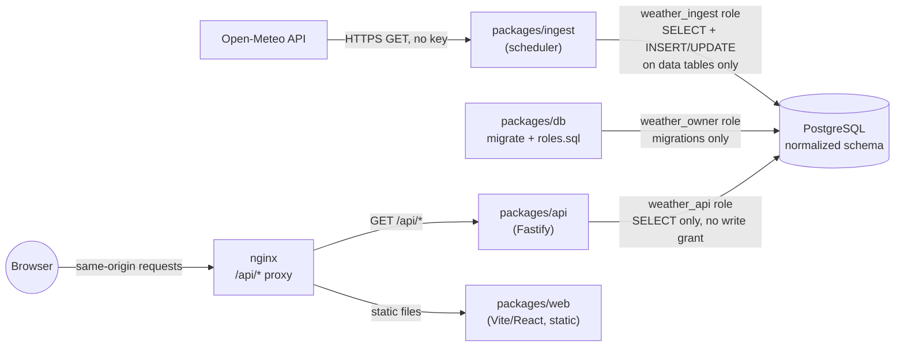

# Architecture

This document explains how `weather-demo` (public name: "Probably Weather") is put together and,
more importantly, _why_ — the constraints each decision is a response to. For the governing rules
themselves see [`.specify/memory/constitution.md`](.specify/memory/constitution.md); this document
is the narrative explanation, not a duplicate of the rules.

## What this project is optimizing for

Before the folder structure makes sense, it helps to know what kind of project this is: a
**portfolio demo**, built feature-by-feature under spec-kit, whose job is to _demonstrate_
engineering judgment as much as to serve weather data. That framing explains several choices that
would look like over-engineering in a plain CRUD app:

- Security is enforced **in depth**, not by convention, because the app is public and has no
  recovery path if the read-only guarantee is ever violated.
- The schema is normalized to 3NF because "how would you evolve this" is a question the codebase
  itself should be able to answer.
- Every file is capped at 600 lines, mechanically, because a monolithic files are not maintainable.
- Accessibility is a spec-time gate, not a lint pass tacked on afterward.

Keep this lens on while reading the rest of the document — most "why is this here" questions
resolve to one of these four pressures.

## System overview

Four processes, one database, three Postgres roles. The whole system is describable as: **one
writer no one can reach from the internet, one reader that can't write, and a browser that can't
talk to Postgres at all.**

## Why a monorepo with five packages

`packages/{db,api,ingest,ui,web}` are separate npm workspaces, each independently buildable,
typecheckable, and testable. The split follows _deployment boundary_ and _privilege boundary_
first, reuse second:

| Package           | Runs as                                  | Why it's separate                                                                                                                                                                                                                                                                                                                                                                |
| ----------------- | ---------------------------------------- | -------------------------------------------------------------------------------------------------------------------------------------------------------------------------------------------------------------------------------------------------------------------------------------------------------------------------------------------------------------------------------- |
| `packages/db`     | (library, not a process)                 | Owns the Prisma schema, checked-in migrations, repository functions, and role/grant DDL. Everything that touches SQL goes through here — `api` and `ingest` never import Prisma directly, they import typed repository functions. This is what makes "no raw SQL from request input" (constitution Principle III) checkable by reading imports rather than auditing every route. |
| `packages/api`    | its own container, `weather_api` role    | The only process the public internet can reach for data. Connects to Postgres with a role that has **no write grant on anything** — not an application-level check, a database-level guarantee.                                                                                                                                                                                  |
| `packages/ingest` | its own container, `weather_ingest` role | The only process allowed to write. Runs on a schedule, not on request, so there is no user-triggered code path that touches a write-capable credential.                                                                                                                                                                                                                          |
| `packages/ui`     | (library, not a process)                 | Accessible component primitives (React Aria Components wrappers) with zero knowledge of weather domain concepts — `Button`, `Table`, `Tabs`, `SparklineChart`, the live-region `announcer`. Framework-and-a11y concerns live here so `web` doesn't have to re-solve them per feature.                                                                                            |
| `packages/web`    | static files behind nginx                | The SPA. Built to static assets at container build time — there is no Node server for the frontend at runtime, which removes an entire class of runtime dependency from the public-facing surface.                                                                                                                                                                               |

A new package needs only its own `package.json` (with a `typecheck` script) and a `tsconfig.json`
extending the shared `tsconfig.base.json`; the root `lint`/`typecheck`/`test` scripts pick it up
automatically. This low ceremony is deliberate — it's what makes "add a package" a viable answer
in a spec's plan instead of a reason to cram something into an existing one.

## Why Postgres roles instead of an application-layer read-only flag

`packages/db/roles.sql` (mirrored executably in `src/apply-roles.ts`) creates two application
roles beyond the owner:

- `weather_api` — `SELECT` only, on every table, including future ones (`ALTER DEFAULT
PRIVILEGES`).
- `weather_ingest` — `SELECT` everywhere (it needs to read `cities`/`providers`/lookups to build
  upserts), but `INSERT`/`UPDATE` only on the four tables it actually populates
  (`ingest_runs`, `observations`, `forecast_hourly`, `forecast_daily`). Neither role gets `DELETE`
  or DDL.

The rationale (constitution Principle III) is that a bug in the API layer — a stray write query, a
future contributor adding a `POST` route without thinking it through — **cannot** become a
data-integrity incident, because the database itself will reject the write regardless of what the
application code does. This is layered with two application-level checks that reinforce the same
guarantee rather than substitute for it: `app.test.ts` asserts every registered route is a `GET`,
and every query goes through typed repository functions in `packages/db` (never raw SQL built from
request input).

Migrations run under a third role (`weather_owner`) that only the one-shot `migrate` container
uses — the long-running `api` and `ingest` processes never hold owner-level credentials.

## Why Prisma + checked-in SQL migrations (and why it changed)

The project migrated from Drizzle ORM to Prisma 7 (see `b897338`). `packages/db/prisma/schema.prisma`
is the single source of truth for the shape of the schema; `prisma/migrations/` holds the
generated, checked-in SQL. Constitution Principle IV requires every schema change to ship as a
migration file — no direct schema pushes to any shared environment, including CI and Docker — so
that environments can never silently drift apart. Prisma 7 requires an explicit driver adapter
(`@prisma/adapter-pg`) rather than a bare connection string; `packages/db/src/client.ts` is a thin
wrapper that hands a role-specific connection string to that adapter, and separately exposes a raw
`pg` `Pool` (`createAdminPool`) for the one thing Prisma Client itself doesn't do — the `CREATE
ROLE`/`GRANT` DDL in `apply-roles.ts`.

Physical table/column names are pinned with `@map`/`@@map` in the Prisma schema specifically
because `roles.sql` grants privileges by those names directly — renaming a Prisma field must not
silently rename the underlying column the grants depend on.

## Why the schema looks normalized to a fault

Lookup values — weather codes, units, providers, measurement types — are their own tables,
referenced by foreign key, never duplicated as free-text or repeated per row. Two things this
buys, beyond "it's 3NF":

- **Units are recorded once per (provider, measurement) pair** (`ProviderUnit`), not on every
  observation/forecast row — the ingest pipeline always requests the same units from a given
  provider, so per-row unit columns would be pure redundancy.
- **`IngestRun` is a first-class row**, not just a timestamp column. Every observation/forecast
  row has an `ingestRunId` FK, which is what lets the API answer "when was this last refreshed"
  from the run's own `finishedAt` rather than from the observation's `observedAt` — those two
  timestamps can legitimately differ, and conflating them would misreport freshness.

`(cityId, observedAt)` / `(cityId, validAt)` / `(cityId, validDate)` uniqueness constraints make
re-ingestion an upsert, not an append — the scheduler can safely re-run without producing
duplicate rows, which matters because it does re-run, hourly, forever.

## The ingest pipeline: pull, not push, and partial failure is not total failure

`packages/ingest` is deliberately dumb in shape: `scheduler.ts` runs a cycle immediately on boot
(so a fresh `docker compose up` has data without waiting an hour) and then on a fixed interval,
guarding against overlap — if a cycle is still running when the next tick fires, that tick is
skipped rather than starting a concurrent run. `cycle.ts` then loops over every seeded city,
fetches, maps, and upserts, and — this is the important part — **catches per-city failures
individually**. One city's network error or validation failure is recorded in the run's `error`
summary and does not stop the other cities from ingesting. The run itself is still `success` as
long as it completed. This exists because "one bad city shouldn't degrade the whole demo" is a
real failure mode with a public, unauthenticated upstream (Open-Meteo) that offers no SLA.

Open-Meteo was chosen specifically because it requires no API key — the entire stack, including
CI, is runnable by a stranger who clones the repo with zero credential provisioning.

## The API layer: schema-first, GET-only, one error shape

`packages/api` is Fastify with `fastify-type-provider-zod`: every route declares a Zod schema for
params/querystring/response, which does double duty as request validation and as the source for
the generated OpenAPI docs at `/api/docs` (`openapi.ts`). `app.ts` installs an `onRoute` hook that
records every registered route into `app.registeredRoutes` — not for runtime use, but because
`app.test.ts` iterates that list and asserts every single one is a `GET`. That test is what turns
"the public surface is read-only" from a promise into something CI enforces on every PR.

Route handlers stay thin — they call a repository function from `packages/db`, then a serializer
(`serializers.ts`) that shapes Prisma's `Decimal` and `Date` types into the plain
strings/numbers/ISO-8601 the OpenAPI schema promises. Handlers never touch Prisma directly and
never see a raw SQL string.

## The frontend: why hooks, not a state management library

`packages/web` has no Redux/Zustand/React Query. That's a fit-for-purpose call, not an oversight:
the app has exactly two categories of state, and each has a solution sized to it.

### Server data: `useAsync` + thin per-resource hooks

`hooks/useAsync.ts` is a ~25-line generic hook (loading/success/error) shared by every `use*` data
hook (`useCities`, `useCityDetail`, `useForecast`). Each of those hooks is a one-line wrapper
around one `api-client.ts` call plus a dependency array — there is no caching layer, no
invalidation logic, no request deduplication, because this app has no mutations to invalidate
against and no data that's fetched from more than one place at once. `useForecast` fetches both
the hourly _and_ daily ranges eagerly on mount rather than lazily on tab switch, specifically so
the Tabs component (an a11y-reviewed pattern) only ever toggles visibility of already-loaded data —
switching tabs must never trigger a network request or a loading-state flash for a user relying on
a screen reader to track what just changed. Pulling in a data-fetching library to get cache
semantics this app doesn't need would be exactly the kind of premature abstraction the project
otherwise avoids.

`lib/api-client.ts` is a single file: typed response interfaces mirroring the API's OpenAPI shapes,
one `ApiError` class (distinguishing network failures from non-2xx responses via an optional
`status`), and four thin `fetch` wrappers. Nothing more — no interceptors, no retry logic, because
none of that is asked for by a read-only demo against a same-origin API.

### Client-only visitor preferences: a hand-rolled store + React Context

The one piece of genuinely client-owned state — a pinned "home city" (spec 006) — gets its own
purpose-built layer instead of just a `useState` + `useEffect(localStorage.setItem)` pair, because
that obvious-looking pattern has two real failure modes this app needed to avoid:

1. **`lib/visitor-context-store.ts`** owns storage mechanics only (read/write/parse/clear) behind
   a `StorageLike` interface, not ambient `globalThis.localStorage`. This is what makes it unit
   testable under Vitest's `node` project (no jsdom) and what makes quota-exceeded / storage-
   disabled / blocked-cookie failures simulable at all — a real `Storage` object can't be coerced
   into throwing on demand. Every method degrades to an in-memory-only value on any thrown error,
   so a pin still works for the rest of the tab's session even when nothing durable was written.
   Parsing is defensive field-by-field (`parseState`): a valid envelope with a corrupted payload
   yields a safe default for just that field, not a wholesale rejection — so one bad field can't
   corrupt a sibling field a future schema version might add.

2. **`context/VisitorContextProvider.tsx`** owns the React-facing API and makes two choices that
   only matter once you've hit React 18 `<StrictMode>` in anger: state is hydrated from storage in
   the `useState` lazy initializer (a pure read, safe to double-invoke), never in a `useEffect` —
   an effect-based read would render one frame with `homeCity: null` before the real value
   appeared, visibly popping the header link in on every page load. And state is never mirrored to
   storage via an effect; every write happens inside an action callback in direct response to a
   user action, so there's no render-triggered side effect for StrictMode's double-invocation to
   corrupt. Cross-tab sync is handled by listening for the `storage` event and re-running the same
   validated `parse()` a foreign tab's write goes through, so another tab (or a hand-edited
   localStorage value) can't inject an invalid shape into this one.

The result reads as more code than `useState` + an effect, and it is — but each extra piece maps
to a specific failure this app has actually reasoned through (StrictMode double-render, quota
exhaustion, cross-tab desync, malformed storage payloads), not defensive coding against
hypotheticals.

### Design tokens as CSS custom properties, not a JS theme object

`packages/ui/src/tokens.css` defines the color palette as CSS custom properties (light default,
`prefers-color-scheme: dark` override), consumed via Tailwind arbitrary-value syntax
(`bg-[var(--color-bg)]`) rather than through Tailwind's JS theme config. Every text/background and
focus/background pair is annotated with the WCAG contrast ratio it must clear, and `tokens.test.ts`
computes the actual contrast ratio from the hex values — a same-file assertion, not a
design-review eyeball check, so a token can't silently regress contrast. `forced-colors: active` is
explicitly left to the OS (`forced-color-adjust: auto`) rather than overridden, because
overriding it is the more common way to _break_ Windows High Contrast Mode, not support it.

## Accessibility as a build-time and spec-time constraint, not a checklist

This is a WCAG 2.2 AA project by constitution (Principle I), and the mechanism matters more than
the target: every UI-touching spec must write out the accessibility contract (components,
accessible names, keyboard behavior, ARIA state, live regions, testing strategy, known limitations)
_before_ implementation starts, using `.github/skills/building-accessible-ui/SKILL.md` as the
checklist. A spec that renders UI without that section is, by definition, under-specified and
cannot proceed. This is why `specs/00N-*` directories read like design documents with an
accessibility section baked in, not retrofitted a11y notes.

Two concrete mechanisms worth knowing about because they recur across the UI package:

- **`packages/ui/src/announcer.ts`** is a hand-built live-region singleton (`role="status"` /
  `role="alert"`, never raw `aria-live` combined with `role="alert"`) that queues messages with a
  timed display/gap cycle rather than writing text synchronously — screen readers can miss an
  announcement if the live region's content changes before assistive tech has processed the
  previous change. Regions are visually hidden via `clip`, never `display:none`, because the
  latter removes them from the accessibility tree entirely.
- **Route-change focus management** (`useFocusMainOnRouteChange`) and **layout stability**
  (`App.tsx` reserving `min-h-10` on the header so a conditionally-rendered "home city" link
  appearing/disappearing never reflows content under a control that currently has focus) are both
  examples of the same principle: a client-rendered SPA has to manually replace behaviors a
  full page navigation gives you for free.

Every rendered surface also carries an automated axe scan as part of its test suite (constitution
Principle II) — `e2e/axe-helper.ts` plus per-page assertions in the Playwright specs — and that
scan must be re-run against the literal artifact being submitted, not a pre-edit snapshot.

## Testing strategy: matched to what each layer can fail at

- **Vitest unit tests** sit next to the file they test (`Button.test.tsx` beside `Button.tsx`,
  etc.) — no separate `__tests__` tree, so a file approaching the 600-line ceiling and its test are
  never mistaken for unrelated concerns.
- **`packages/db`, `packages/api`, `packages/ingest` integration tests run against a real
  Postgres**, not a mock. Given how much of this project's design is "the database enforces the
  guarantee," a mocked Postgres would validate the wrong thing — whether the _code_ looks right,
  not whether the _role grants_ actually hold.
- **Playwright e2e** (`e2e/*.spec.ts`) covers city list, city detail, keyboard navigation, and the
  visitor-context (home city) flow end-to-end in a real browser, with the axe scan riding along.
- **`npm run harness:check`** is specific to this repo's agent-authoring setup: it verifies that
  every skill vendored under `.github/skills/` has versioned frontmatter matching a content hash
  recorded in `.harness/manifest.json`, so an in-place edit to a skill without a version bump fails
  CI instead of silently drifting from what agents actually read.

## Deployment: multi-stage Docker images, nginx as the only public entrypoint

`docker-compose.yml` (via `docker/Dockerfile.{api,ingest,migrate,web}`) builds four images. The
`migrate` service is one-shot: it runs Prisma migrations and `apply-roles.ts`, then exits; `api`,
`ingest`, and `web` don't start serving traffic until it exits `0`. `web`'s image is nginx serving
the Vite-built static bundle, with `/api/` reverse-proxied to the `api` container inside the
compose network (`docker/nginx.conf`) — the browser only ever calls same-origin relative `/api/*`
paths, so there's no CORS configuration or baked-in API base URL to keep in sync between
environments. This also means nginx, not the API, is the only process the public internet reaches
directly.

## Spec-driven development: why `specs/NNN-*` exists at all

Every feature is planned through the spec-kit cycle — `/speckit-specify` → `/speckit-plan` →
`/speckit-tasks` → `/speckit-implement` — with one `specs/NNN-*` directory per feature
(`001-platform-foundation-npm` through `006-visitor-context` at present). The constitution requires
implementation commits to reference the spec they implement. The practical effect, visible
throughout this codebase, is that non-obvious decisions are annotated with _why_ inline (`spec
006`, `constitution Principle III`, `references/status-messages.md`) rather than left for a future
reader to reverse-engineer from the diff — the comments in this repo consistently point at a
spec or principle, not at a restatement of what the code does.

## Where the four pressures show up, at a glance

| Pressure                    | Where you see it                                                                                                                    |
| --------------------------- | ----------------------------------------------------------------------------------------------------------------------------------- |
| Security in depth           | Three Postgres roles, GET-only route assertion, no raw SQL from request input                                                       |
| Normalized/evolvable schema | Lookup tables for codes/units/providers, `IngestRun` as a first-class row, upsert-safe uniqueness constraints                       |
| 600-line file ceiling       | Repository functions split by table; components split from their test files; `serializers.ts` split from `schemas.ts`               |
| Accessibility as a gate     | Spec's accessibility contract section, `announcer.ts`, focus management hooks, contrast-tested design tokens, axe in every e2e spec |
