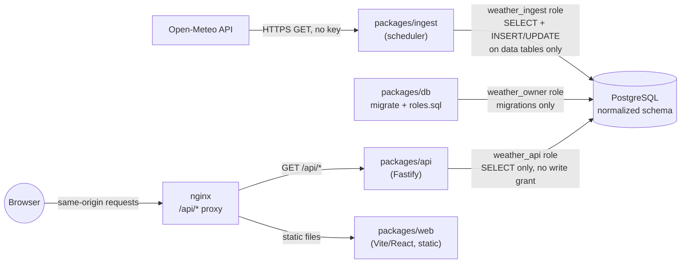

# Probably Weather

An accessible, spec-driven weather forecast portfolio demo (workspace/package name: `weather-demo`):
React + Node.js + PostgreSQL, built
feature-by-feature under [GitHub spec-kit](https://github.com/github/spec-kit) with a
[WCAG 2.2 AA accessibility contract](.github/skills/building-accessible-ui/SKILL.md) required in
every UI spec before implementation starts. See [`.specify/memory/constitution.md`](.specify/memory/constitution.md)
for the project's governing principles.

**Live site:** [weather.mfairchild365.com](https://weather.mfairchild365.com/) (self-hosted).

## Architecture



Three least-privilege Postgres roles are the read-only guarantee, not a convention: `weather_api`
has no write grant on anything, so a bug in the API layer can't become a data-integrity incident.
See [Database](#database) below and [`packages/db/roles.sql`](packages/db/roles.sql).

## Quickstart

```sh
cp .env.example .env
docker compose up --build
```

That builds and starts Postgres, then runs a one-shot `migrate` service that applies schema
migrations, creates the least-privilege database roles, and seeds a starter set of cities. Once
`migrate` exits `0`, three long-running services start: `ingest` (fetches every seeded city's
current conditions and forecast from Open-Meteo immediately, then hourly), `api` (serves that data
read-only at `http://localhost:3000`), and `web` — the public site, at **`http://localhost:8080`**.

Open `http://localhost:8080` in a browser to search cities and browse forecasts, or try the API
directly:

```sh
curl http://localhost:3000/api/cities
curl http://localhost:3000/api/cities/tokyo-jp
curl 'http://localhost:3000/api/cities/tokyo-jp/forecast?range=hourly'
curl http://localhost:3000/api/meta/freshness
```

Browse the API docs at `http://localhost:3000/api/docs`, or inspect the database directly:

```sh
docker exec -it weather-demo-postgres-1 psql -U weather_owner -d weather_demo -c '\dt'
docker exec -it weather-demo-postgres-1 psql -U weather_owner -d weather_demo -c 'select name, slug from cities;'
```

## Workspace layout

npm workspaces monorepo; every package under `packages/` has its own `package.json` and
`tsconfig.json` (extending the shared [`tsconfig.base.json`](tsconfig.base.json)) and is picked up
automatically by the root `lint` / `typecheck` / `test` scripts — no per-package wiring needed.

| Package           | Purpose                                                                                       |
| ----------------- | --------------------------------------------------------------------------------------------- |
| `packages/db`     | Prisma schema, checked-in SQL migrations, least-privilege role setup, seed data, repositories |
| `packages/api`    | Fastify REST API (read-only `GET` routes only, OpenAPI docs at `/api/docs`)                   |
| `packages/ingest` | Scheduled worker that pulls weather data from Open-Meteo (on boot, then hourly)               |
| `packages/ui`     | Accessible component library (React Aria Components + Tailwind)                               |
| `packages/web`    | The Vite/React SPA — city search + per-city Hourly/Daily forecast browser                     |

Adding a new package: create `packages/<name>/package.json` (with a `typecheck` script) and
`tsconfig.json` extending `../../tsconfig.base.json`; `npm install` at the root links it, no
further configuration required.

## Local development

```sh
npm install
npm run lint          # ESLint, includes a 600-line-per-file ceiling enforced as an error
npm run typecheck      # tsc --noEmit across every workspace package + e2e/playwright.config.ts
npm test               # Vitest — unit tests, plus packages/{db,api,ingest} integration tests
npm run test:e2e        # Playwright — see "End-to-end tests" below
```

`packages/db`'s tests (and `packages/api`/`packages/ingest`'s integration tests) run against a
real Postgres instance. Point them at any throwaway database, for example the one `docker compose`
already starts:

```sh
docker compose up -d postgres
export DATABASE_URL_OWNER=postgresql://weather_owner:<POSTGRES_PASSWORD from .env>@localhost:55432/weather_demo
export TEST_DATABASE_URL=$DATABASE_URL_OWNER
npm test
```

To work on `packages/web` with hot reload outside Docker: `npm run dev --workspace packages/web`
(proxies `/api` to `http://localhost:3000` — run `docker compose up api migrate` first, or run
`packages/api` locally with `DATABASE_URL_API` pointed at a seeded database).

### End-to-end tests

Playwright + `@axe-core/playwright` drive a real browser against a **running** instance of the
site — this doesn't start one for you, since a meaningful run needs Postgres, ingested data, and
the API behind it:

```sh
cp .env.example .env
docker compose up --build -d
npx playwright install --with-deps chromium   # first time only
npm run test:e2e
```

By default it targets `http://localhost:8080` (the compose stack's `web` service); override with
`PLAYWRIGHT_BASE_URL` to point at a different host/port (e.g. `npm run dev` on 5173).

## Database

- Schema is normalized (3NF) and lives in [`packages/db/prisma/schema.prisma`](packages/db/prisma/schema.prisma)
  (Prisma ORM, via [`@prisma/adapter-pg`](https://www.prisma.io/docs/orm/overview/databases/postgresql) —
  see [`packages/db/src/client.ts`](packages/db/src/client.ts)). Every schema change ships as a
  generated, checked-in migration: author it with `npm run db:migrate:dev` (dev-only — creates and
  applies a new `packages/db/prisma/migrations/*` folder), never `prisma db push`. `npm run
db:generate` is a separate, non-destructive step that only refreshes the generated Prisma Client
  (`packages/db/src/generated/`, gitignored) from the current schema — run it after pulling a
  schema change, and it also runs automatically as part of every Docker build and CI job.
- Three Postgres roles enforce that **the public surface is read-only**: `weather_owner` (runs
  migrations, owns all objects), `weather_ingest` (`SELECT`, plus `INSERT`/`UPDATE` only on the
  tables the ingestion job populates), `weather_api` (`SELECT` only, on every table present and
  future). See [`packages/db/roles.sql`](packages/db/roles.sql) and
  [`packages/db/src/apply-roles.ts`](packages/db/src/apply-roles.ts).
- Weather data is never written by user request — only by the scheduled ingestion worker
  (`packages/ingest`).
- The project moved from Drizzle ORM to Prisma; the migration history was rebaselined rather than
  translated statement-by-statement (verified schema-equivalent against the prior Drizzle
  migration before the swap — see the commit history). Any existing database, including the
  self-hosted live site above, needs a fresh `docker compose down -v` + `up` rather than an
  in-place upgrade — all data is re-ingestible from Open-Meteo within one cycle, so this is a
  non-issue in practice.

## API

Every route is `GET`; an automated test (`packages/api/src/app.test.ts`) fails the build if any
route ever accepts `POST`/`PUT`/`PATCH`/`DELETE`.

| Route                                                | Description                                                                                            |
| ---------------------------------------------------- | ------------------------------------------------------------------------------------------------------ |
| `GET /api/health`                                    | Liveness check                                                                                         |
| `GET /api/cities`                                    | Every seeded city, with its region                                                                     |
| `GET /api/cities/:slug`                              | City detail, latest observation, and when it was last refreshed                                        |
| `GET /api/cities/:slug/forecast?range=hourly\|daily` | Forecast rows for that city                                                                            |
| `GET /api/meta/freshness`                            | Provider name and the most recent successful ingest run                                                |
| `GET /api/docs` / `GET /api/openapi.json`            | Browsable / machine-readable API docs, generated from the same zod schemas that validate every request |

## Ingestion

`packages/ingest` fetches current conditions plus 7 days of hourly and daily forecast from
[Open-Meteo](https://open-meteo.com/) for every city in `cities`, immediately on start and then
hourly. Each run writes one `ingest_runs` row; a single city's failure (network error or a response
that fails schema validation) is recorded and skipped without stopping the rest of the cycle or
crashing the worker. Re-ingesting the same city upserts on each table's unique (city, valid-time)
constraint, so re-running never duplicates rows.

## Web UI

`packages/web` is a Vite/React SPA with two routes, talking to the API over relative `/api/*`
paths only (nginx proxies these to the `api` service in Docker; Vite's dev server proxies them
locally — see `packages/web/vite.config.ts`). No direct database access, ever.

| Route           | Shows                                                                                |
| --------------- | ------------------------------------------------------------------------------------ |
| `/`             | Every seeded city, filterable by name/region, linking to its forecast                |
| `/cities/:slug` | Current conditions, freshness, and an Hourly/Daily forecast table + decorative chart |

## Accessibility

Every user-facing feature's spec includes a full accessibility contract (components, accessible
names, keyboard/focus behavior, live regions, testing strategy, known limitations) before
implementation begins — see
[`references/spec-driven-development.md`](.github/skills/building-accessible-ui/references/spec-driven-development.md)
and the [`003-accessible-forecast-browser`](specs/003-accessible-forecast-browser/spec.md) spec's
own `## Accessibility` section, which this statement summarizes.

**What was tested** (constitution Principle II — re-run against the exact artifact submitted, not
a promise to test later):

- **Automated, component-level**: every `packages/ui` component and `packages/web` page has a
  `vitest-axe` scan in its own test file, covering more than the default render — loading, error,
  empty-result, and both-tab states are each scanned separately.
- **Automated, end-to-end**: `e2e/*.spec.ts` (Playwright + `@axe-core/playwright`) runs a
  full-page scan against the live site for the city list (default/filtered/empty-result) and city
  detail (hourly/daily/not-found) pages; a keyboard-only journey from the skip link through a city
  link, page-change focus, and arrow-key tab switching; a 320 CSS px reflow check; and a
  `forced-colors: active` pass confirming focus and tab-selected indicators stay visible. These run
  in CI on every PR (`.github/workflows/ci.yml`'s `e2e` job) with the HTML report uploaded as an
  artifact.
- **Manual**: keyboard-only pass and a visual check under `forced-colors: active` in a real
  browser, alongside the automated suite above.

One real gap the automated suite caught and the fix for it: `@axe-core/playwright`'s
color-contrast check flagged the footer's inline "Open-Meteo" attribution link as
indistinguishable from surrounding text (color alone, ~1.1:1 contrast against the link) —
`vitest-axe` running under jsdom did not catch this, because jsdom's lack of real canvas/color
rendering makes color-contrast checks unreliable there. Fixed by underlining the link, not just
recoloring it. This is why both test tiers exist: component-level axe scans catch structural
issues fast, but real color-contrast verification needs a real rendering engine.

A second gap, caught this time by computing ratios directly rather than by axe: `004`'s new teal
accent, plugged into the _existing_ primary `Button` variant's hardcoded `text-white`, dropped to
1.48:1 in the dark theme — worse than the 2.54:1 the original blue accent already had (a
pre-existing, unnoticed failure below the 4.5:1 AA threshold). Fixed by making the button's text
color `var(--color-bg)` instead of a literal white — `--color-focus` and `--color-bg` invert
together between themes, so the pairing holds >=4.5:1 in both (verified in `tokens.test.ts`, not
eyeballed). A lesson for future palette swaps: re-verify every token's _downstream_ usages, not
just the token's own contrast against page backgrounds.

**Known limitations** (no "fully accessible" claim — see each spec's `known_limitations` for the
full list with affected personas):

- City search is exact-substring, not fuzzy/typo-tolerant.
- The decorative sparkline chart's visual trend isn't separately summarized in prose; screen
  reader users get the same numbers as sighted users via the paired table, not an at-a-glance
  trend description.
- The Hourly view is capped at the next 24 hours in the UI (the API has up to 168 hours available).
- No offline/service-worker support.
- The site's deadpan-forecaster copy (spec `004-probably-weather-personality`) can be misread by
  some cognitive and neurodivergent users, and by non-native English readers, who may take a wry
  line literally or find it unclear. Every joke line keeps its plain-language fact directly
  adjacent — no information is ever _only_ available via the joke — but the risk of misreading
  isn't eliminated.

## CI/CD

- **`.github/workflows/ci.yml`** — every push/PR: lint (incl. the 600-line ceiling) → typecheck →
  format check → migrate/roles/seed against a `postgres:16` service container → unit/integration
  tests → schema smoke check → `e2e` job (builds and runs the full `docker compose` stack, then
  the Playwright + axe suite against it, uploading the HTML report as an artifact).
- **`.github/workflows/release.yml`** — on a `vX.Y.Z` tag: builds and pushes `migrate`/`api`/
  `ingest`/`web` images to `ghcr.io/<repo>-<service>`, tagged with the version and commit SHA.

## Specs

Each feature is planned under `specs/NNN-<slug>/` (`spec.md` → `plan.md` → `tasks.md`) via
spec-kit:

- [`specs/001-platform-foundation-npm`](specs/001-platform-foundation-npm/spec.md) — monorepo,
  schema, roles, Docker, base CI
- [`specs/002-weather-ingestion-worker`](specs/002-weather-ingestion-worker/spec.md) — ingestion
  worker and read-only API
- [`specs/003-accessible-forecast-browser`](specs/003-accessible-forecast-browser/spec.md) —
  the public SPA, with its full accessibility contract
- [`specs/004-probably-weather-personality`](specs/004-probably-weather-personality/spec.md) —
  the "Probably Weather" voice, visual identity, and weather icons — a re-skin, not a rebuild
